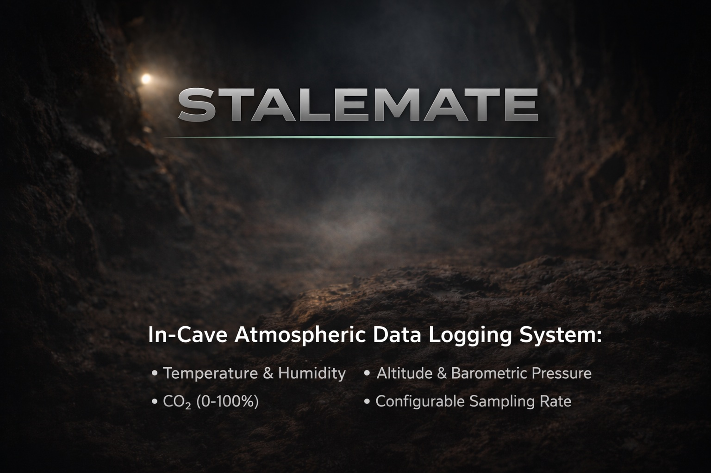
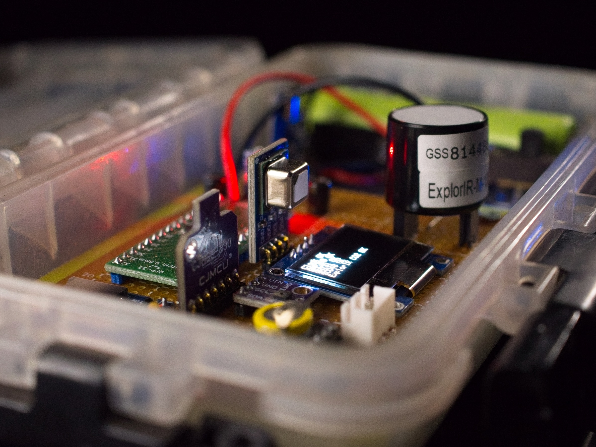
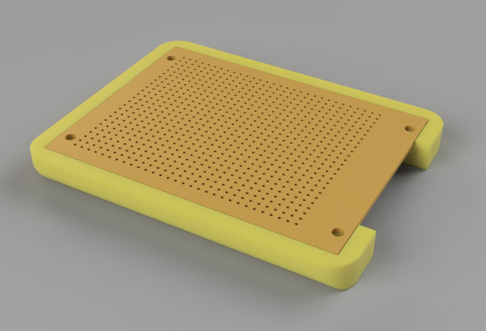
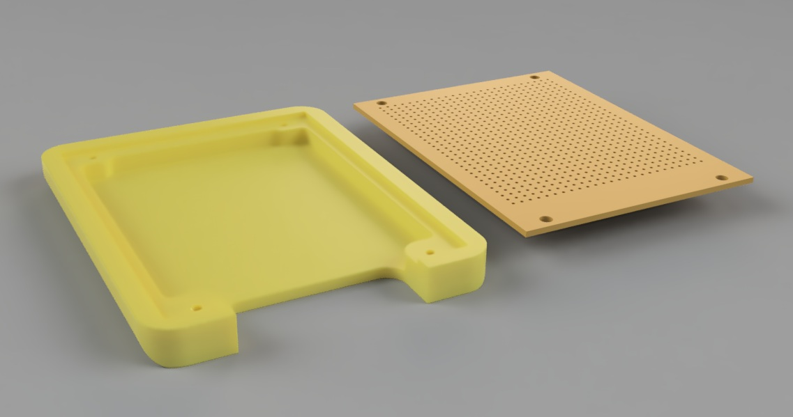
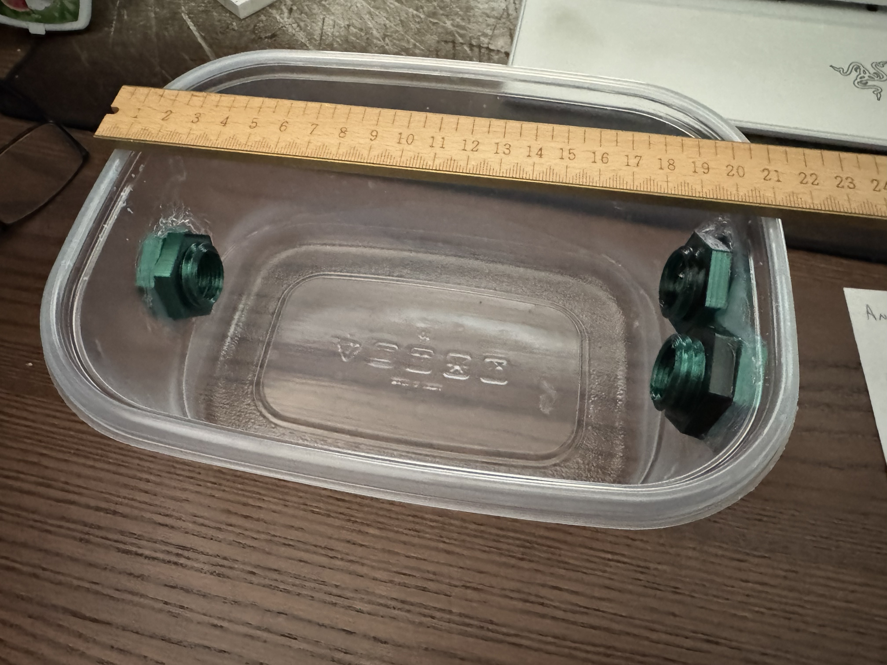
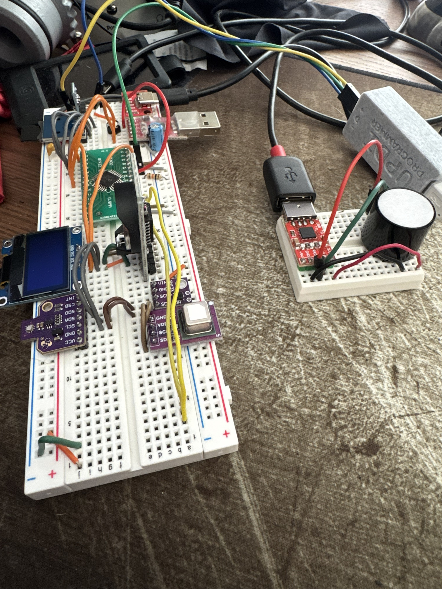
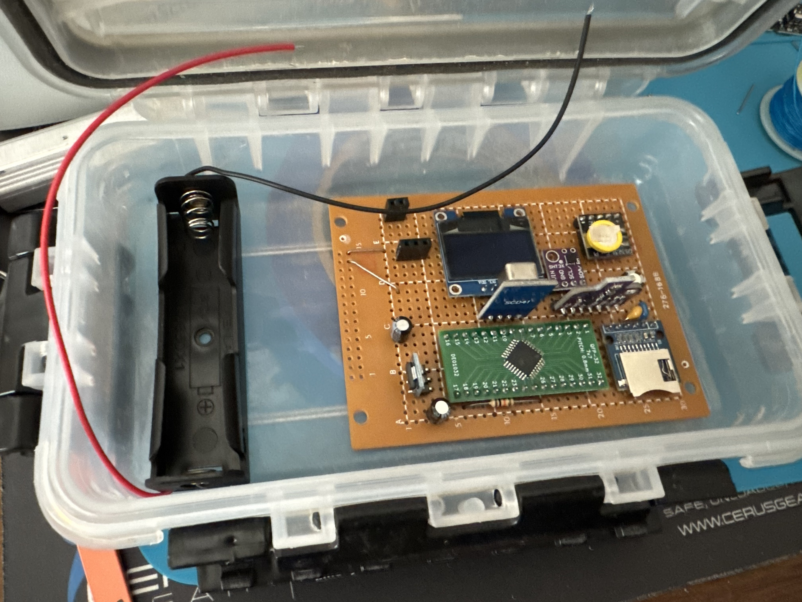
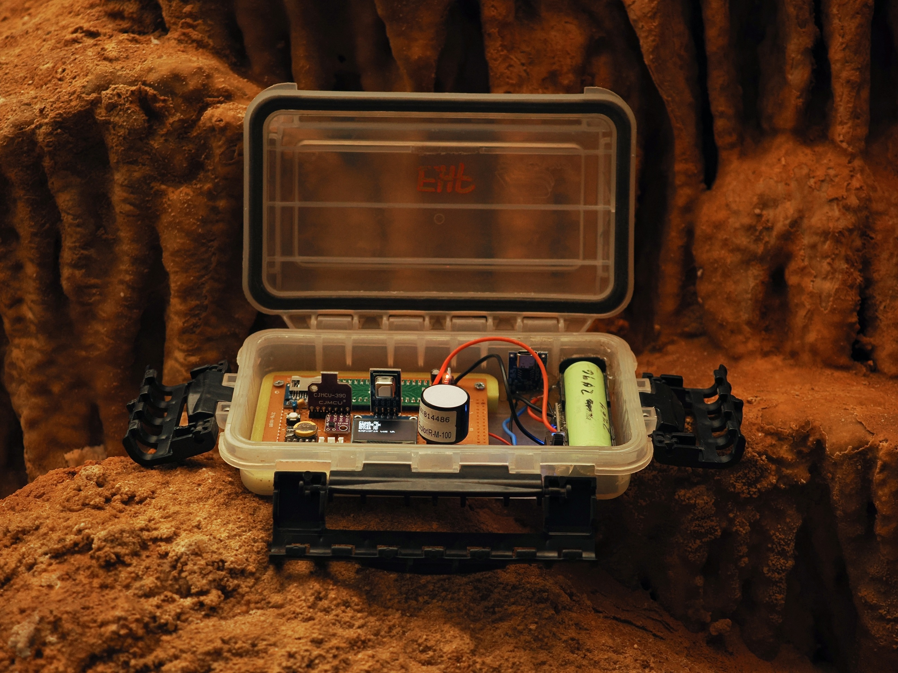
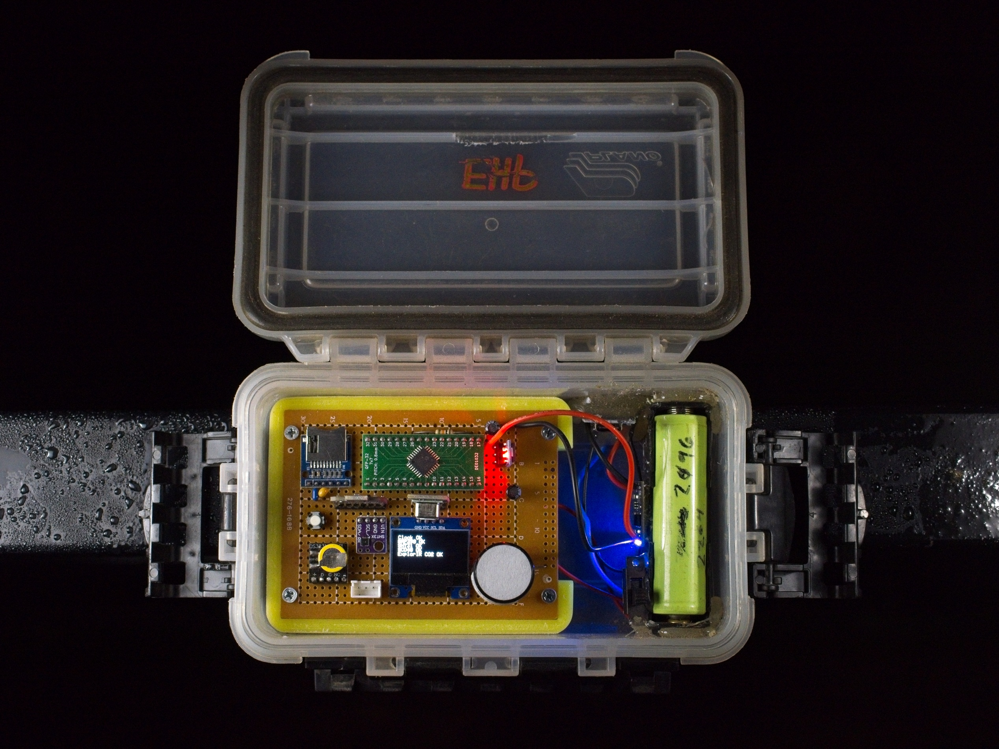
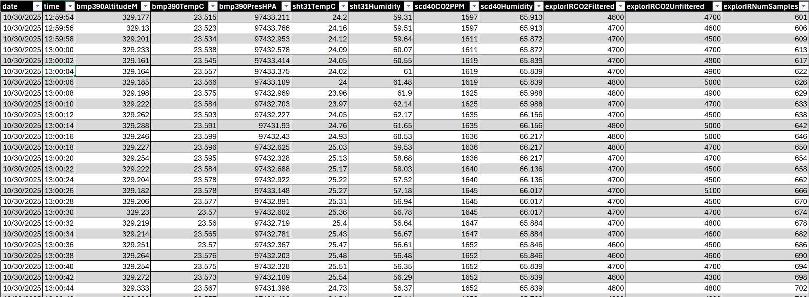

    

    
    
    
    
     
    
    
    
    
    
    
     
    
    
    
    
    

---

<h1>STALEMATE</h1>

# Project Overview

Many of the underground caves in Texas can be difficult to explore, either at all times or just during summer months, due to high CO2 levels.  These levels can range from atmospheric to 1-2% (noticable) all the way up to 3-5% (dangerous).  High CO2 levels can be dangerous and at times life threatening.  Gaining an understanding of the cave atmosphere over time can help to identify better times for exploration and study of the cave, and can quantify the impact higher CO2 levels have on cave fauna.

The goal of this project is to build a long-term data logging system that can monitor typical gasses and conditions found in a cave and record them to storage for later analysis.

# Architecture
## Parts Table
| Part Id | Part Name | Datasheet | Purchase Link |
|-----------|---------|-----------|------------------------|
| AVR128DA32 | Microcontroller | [Datasheet](https://ww1.microchip.com/downloads/en/DeviceDoc/40002183A.pdf) | [Mouser](https://mou.sr/4u1hmi5) |
| MicroSD | MicroSD Card Breakout | | [Amazon](https://www.amazon.com/dp/B00NAY2NAI) |
| DS3231 | Real-Time Clock | [Datasheet](https://www.analog.com/media/en/technical-documentation/data-sheets/ds3231.pdf) | [Amazon](https://www.amazon.com/dp/B0D8HY7HF7) |
| SHT31 | Humidity & Temperature | [Datasheet](https://www.analog.com/media/en/technical-documentation/data-sheets/ds3231.pdf) | [Amazon](https://www.amazon.com/dp/B0B5TN8LZB) |
| BMP380 | Temperature, Pressure, Altitude | [Datasheet](https://www.bosch-sensortec.com/media/boschsensortec/downloads/product_flyer/bst-bmp380-fl000.pdf) | [Amazon](https://www.amazon.com/dp/B0DSVLLHYT) |
| SCD41 | CO2, Temperature, Humidity | [Datasheet](https://sensirion.com/media/documents/E0F04247/631EF271/CD_DS_SCD40_SCD41_Datasheet_D1.pdf) | [Amazon](https://www.amazon.com/dp/B0C622SS34) |
| ExplorIR-M-100 | 100% CO2 Sensor | [Datasheet](https://cdn.shopify.com/s/files/1/0019/5952/files/ExplorIR-M_Data_Sheet_Rev_4.14_-_Updated_Logo.pdf) | (contact mfg) |

## Core Processor Selection

The AVR128DA32 processor is my go-to selection for projects like this.  Simple but feature-rich, no bootloader required, no fancy toolchains.

* Comes in hand-solderable TQFP package (among other packages)
* Plenty of flash (128K) and RAM (16K)
* UPDI programming (can use [DIY programmer](https://github.com/ElTangas/jtag2updi))
* Multiple sets of I2C/SPI/UART ports
* High-res timers & interrupts
* 24MHz operation, 1.8-5.5V bus

## Storage

MicroSD cards were chosen as the storage solution for this project, using buffers in RAM to hold incoming data until full (to prevent wearing out the SD card).  In practical application, this write occurs approximately once a minute based on the chosen sample rates and current data saved to the SD card per record.  The card interfaces with the microcontroller via SPI, and because the system voltage for Stalemate is 3.3V, no level shifting is necessary and a "straight socket breakout" can be used.

## RTC

There are many options available for a battery-backup real-time clock, especially since drift is not a major concern.  The DS3231 was chosen for this project simply because the available breakout board was small and in a form factor that fit nicely into the prototype.  The battery is soldered to the breakout board (as opposed to modules where a battery carrier is used for watch-style batteries) but the battery life is claimed to be something like 5-10 years depending on the source.  The device connects using I2C.

## SHT31

The SHT3X by Sensurion is a pretty standard product used in a lot of devices you probably see every day.  It has a built-in heater that helps to measure humidity more accurately, but this does seem to skew the temperature readings a bit and code needs to be written to avoid the heater window for temperature measurement.  The device connects using I2C.

## BMP380

The BMP380 is another device in the line of the BMP180 and BMP280 but with better precision and lower noise.  The sensor is calibrated at the factory for altitude, so absolute altitude can be read from the unit.

## CO2

Two different CO2 sensors were used for this project - one which had been used in previous projects and one new (more expensive) unit.

### SCD41

The SCD41 is the SCD40's wider range cousin - built for indoor air quality measurement (in large HVAC installations for example) the range of this sensor is from 0ppm to over 40,000ppm (0% to 4% CO2).  The sensor is stable and robust and has been used extensively in other cave applications (such as the CavAir and CavAir Mini).  Readings seem to stay very stable across reboots and over long periods of time.  The device can be calibrated based on altitude and an atmospheric CO2 level (400ish where I live).  The device connects via I2C.

### ExplorIR-M-100

It's rare, but it does happen - some caves have more than 4% CO2 in them.  While not really safe for humans, we still want to monitor and record these levels.  The SCD41 is not capable of reading high enough for some levels we encounter, so a new sensor was needed.

The ExplorIR comes in a variety of models - but they are all separated by "what is the max CO2 you desire to record" and then spread that max level over the same number of digital segments to get the resolutions of your measurements.  Additionally, other models connect via USB, and some models offer breakout boards.  We opted for the simple RS232 versions.

The device has a fairly small "instruction set" that is communicated over 5V serial lines - mainly configuring modes for the device, sample rates, data aggregation, and data format for the output.  We opted for regular data polling output.  The serial interface is also used for calibration in different known gases.

# Construction

## Carrier/Enclosure

It's hard to under-emphasize the abuse some of the cave devices I make go through.  They're thrown in cave packs, dragged through mud, dropped down shafts, jostled next to nalgene bottles, covered in mud, and otherwise unpolitely handled.  Any electronics made for this system needed to account for typical operator usages, so a PCB carrier was needed.  This carrier would be glued into the enclosure, and make it easy to remove the PCB for debugging/programming or other modifications.

The carrier was designed and rendered in Autodesk Fusion360.

## Calibration Box

The most important functionality of this device is its ability to detect up to 100% co2.  A calibration box was built to enclose the sensor, so it could be flooded with 100% CO2 (from a tank) as well as 100% Argon (to verify 0% CO2)

Once the chamber was filled and sealed with a known gas, the serial port interface for the ExplorIR (connected directly to a PC with an RS232 dongle) was used to calibrate the sensor using the appropriate command (calibrate in 0%, calibrate in 100%).

## Human Interface

In the past, smaller and self-contained projects have needed some complex display menus and buttons to configure the devices I've built.  With the number of configurable options, amount of debugging that might be necessary, and just raw amount of data the system would produce, it was decided to use the OLED display for critical in-cave information and to use an external serial port to configure and debug the system.  A menu system for everything from setting the time to calibrating sensors to formatting the SD card was constructed.

The serial port connection is visible in pictures later on in this document - as a white three-pin header next to the OLED display.  A USB dongle (accepts 5V serial port signals and simulates an RS232 port to the host PC/phone) is connected to modify settings, but is not necessary for normal operation of Stalemate.

## Working out the bugs

# Final Result
The Stalemate was taken into several caves in central texas to gather data.  

## Data Output

Data is saved to the SD Card, using a modified standard ISO format - *_YYYYMMDD_HH.csv_*  
Data rolls over to a new file every hour.  Files are either appended or created, as necessary.
Stalemate does not auto-format (FAT) the SD card, but does provide utilities to do so in the serial port menu system.

# Conclusion
**Partial Success?**

This is a great little data recorder, and works well to capture data from functional sensors in a cave environment.  Bigger/multiple batteries can be added to extend the data logger's life.  While a better screen would be nice, this costs power, and for a long-term device in a cave, turning this off after N seconds is a goal.

Unfortunately, the main goal of this project was to monitor high levels of CO2, and the ExplorIR sensor (an over $200 investment) did not hold up its end of the bargain.  The sensor seems to drift over time, eventually getting "stuck" at over 1% CO2.  Compared to the SCD41 device, which holds readings for days on end, this is completly unacceptable.  We are currently discussing our results with the manufacturer to determine what might have happened to the sensor or if we were using the sensor incorrectly.

# Work Left / Known Bugs
* Explor-IR sensor
  * Sensor drifts over time and loses calibration
  * Reach out to manufacturer for guidance
* O2 Sensor
  * Add galvanic O2 sensor to measure in-cave oxygen
* Unit will not start up without SD card inserted
  * The unit should start up and the display should run, even if nothing can be saved to the SD card.

# Credits

Thank you to **Ethan Perrine** of the [Underground Texas Grotto](https://utgrotto.org/) for the inspiration and encouragement to work on this project, as well as his excellent in-cave photos shared on this page.
